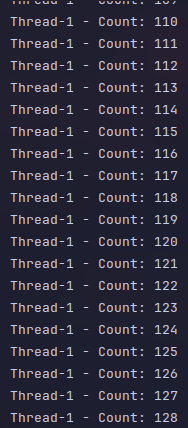
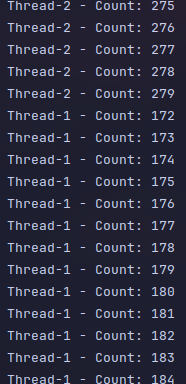
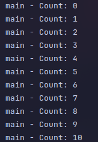
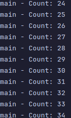

## Parte 1 - Contador de threads

---

##### Clase CountThread 

```java 
public class CountThread extends Thread {
    private final int a;
    private final int b;
    public CountThread(int a, int b){
        this.a = a;
        this.b = b;
    }
    @Override
    public void run() {
        IntStream.range(a,b)
                .forEach(x-> System.out.println(Thread.currentThread().getName() + " - Count: " + x));
    }
}
```

##### Clase CountThreadsMain (con menú interactivo)

```java 
public class CountThreadsMain {
    
    public static void main(String args[]){
        Scanner scanner = new Scanner(System.in);
        
        System.out.println("Ingrese el numero de hilos a crear:");
        int numThreads = scanner.nextInt();
        
        CountThread[] threads = new CountThread[numThreads];
        
        for (int i = 0; i < numThreads; i++) {
            System.out.println("Hilo " + (i + 1) + " - Ingrese el valor inicial (a):");
            int a = scanner.nextInt();
            System.out.println("Hilo " + (i + 1) + " - Ingrese el valor final (b):");
            int b = scanner.nextInt();
            
            threads[i] = new CountThread(a, b);
        }
        
        System.out.println("\n=== MENU DE EJECUCION ===");
        System.out.println("1. Ejecutar con start() (hilos en paralelo)");
        System.out.println("2. Ejecutar con run() (secuencial)");
        System.out.print("Seleccione una opcion: ");
        int opcion = scanner.nextInt();
        
        if (opcion == 1) {
            System.out.println("\nEjecutando hilos con start()...\n");
            for (CountThread thread : threads) {
                thread.start();
            }
        } else if (opcion == 2) {
            System.out.println("\nEjecutando hilos con run()...\n");
            for (CountThread thread : threads) {
                thread.run();
            }
        } else {
            System.out.println("\nOpcion invalida. Saliendo...");
        }
        
        scanner.close();
    }
}
``` 

### Implementación del Menú Interactivo

La clase `CountThreadsMain` fue modificada para permitir al usuario:

1. **Entrada dinámica de intervalos**: El usuario puede especificar cuántos hilos crear y definir los intervalos `[a, b)` para cada uno de forma personalizada.

2. **Menú de selección**: Se implementó un menú que permite elegir entre dos modos de ejecución:
   - Opción 1: Ejecutar con `start()` (hilos en paralelo)
   - Opción 2: Ejecutar con `run()` (ejecución secuencial)

3. **Uso de Scanner**: Se utiliza la clase `Scanner` para capturar la entrada del usuario desde la consola.

4. **Array de hilos**: Los hilos se almacenan en un array para facilitar su creación y ejecución dinámica según la opción seleccionada.

---

### Salida con ```start()```




### Salida con ```run()```




### Comparación: start() vs run()

#### ¿Por qué cambia la salida?

Cuando ejecutamos hilos en Java, existen dos métodos principales: `start()` y `run()`. Aunque ambos ejecutan el código del hilo, funcionan de manera muy diferente:

#### Ejecución con `start()`

- **Crea un nuevo hilo**: El método `start()` le indica a la JVM (Java Virtual Machine) que cree un nuevo hilo de ejecución independiente.
- **Ejecución paralela**: Los hilos se ejecutan de forma concurrente, es decir, pueden correr al mismo tiempo si el sistema tiene múltiples núcleos, o alternarse rápidamente si tiene un solo núcleo.
- **Salida entrelazada**: La salida se mezcla entre los diferentes hilos porque el **scheduler** del sistema operativo decide cuándo cada hilo obtiene tiempo de CPU. Por eso vemos números de diferentes rangos intercalados (ejemplo: Thread-0 imprime 5, luego Thread-1 imprime 100, luego Thread-0 imprime 6, etc.).
- **Concurrencia real**: Cada hilo tiene su propio contexto de ejecución y pila de llamadas.

**Ejemplo de salida con start():**
```
Thread-0 - Count: 0
Thread-1 - Count: 99
Thread-0 - Count: 1
Thread-2 - Count: 200
Thread-1 - Count: 100
Thread-0 - Count: 2
...
```

#### Ejecución con `run()`

- **No crea un nuevo hilo**: El método `run()` simplemente ejecuta el código como si fuera un método normal dentro del hilo principal (main).
- **Ejecución secuencial**: Los hilos se ejecutan uno después del otro, en el orden en que fueron llamados.
- **Salida ordenada**: La salida es completamente secuencial. Primero se imprime todo el rango del primer hilo (0-99), luego todo el segundo (99-199), y finalmente el tercero (200-299).
- **Sin concurrencia**: No hay paralelismo real, todo corre en un solo hilo de ejecución.

**Ejemplo de salida con run():**
```
Thread-0 - Count: 0
Thread-0 - Count: 1
Thread-0 - Count: 2
...
Thread-0 - Count: 98
Thread-1 - Count: 99
Thread-1 - Count: 100
...
Thread-1 - Count: 198
Thread-2 - Count: 200
...
Thread-2 - Count: 298
```

**Conclusión**: `start()` es el método correcto para ejecutar hilos en paralelo y aprovechar el poder de procesamiento de múltiples núcleos. `run()` solo debe usarse si queremos ejecutar el código secuencialmente sin crear hilos nuevos.

