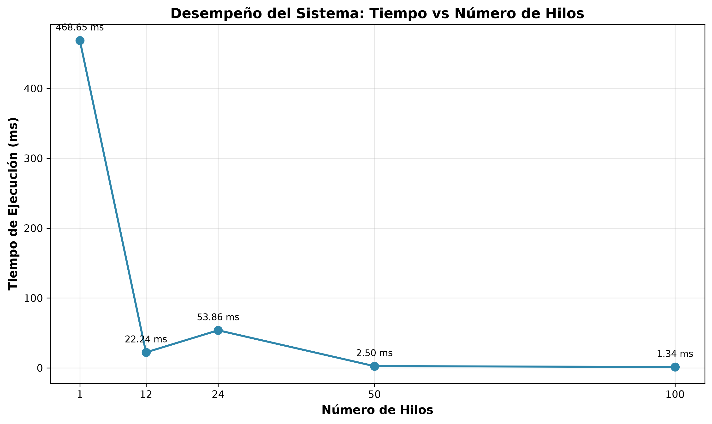
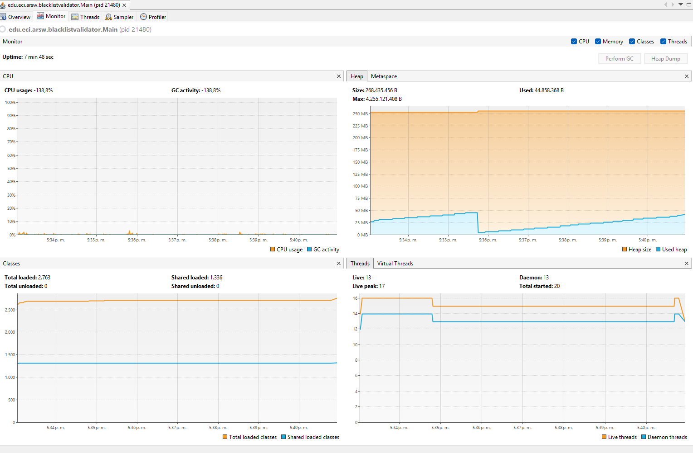
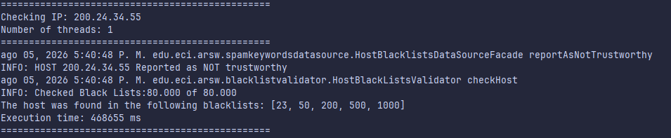
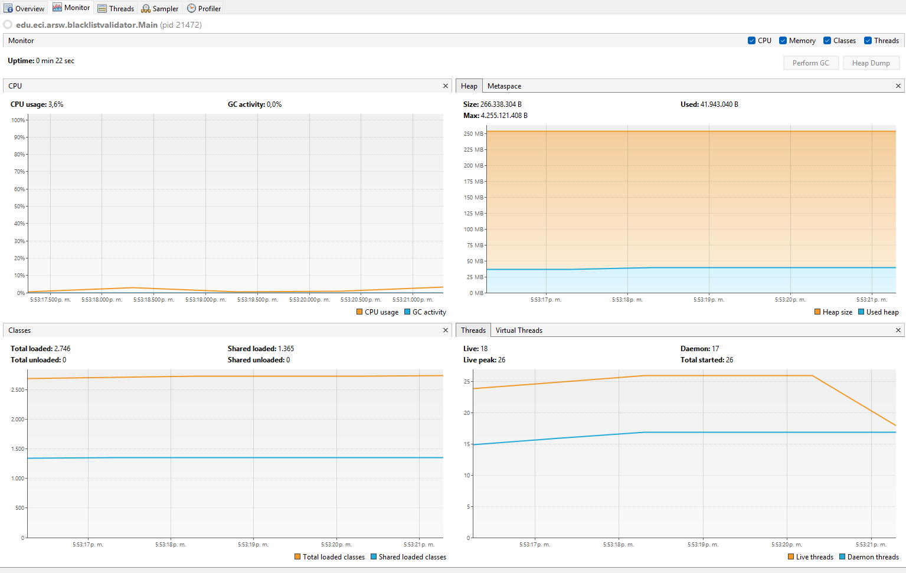
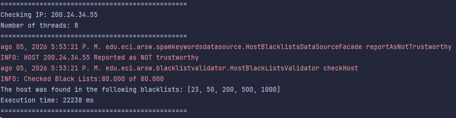
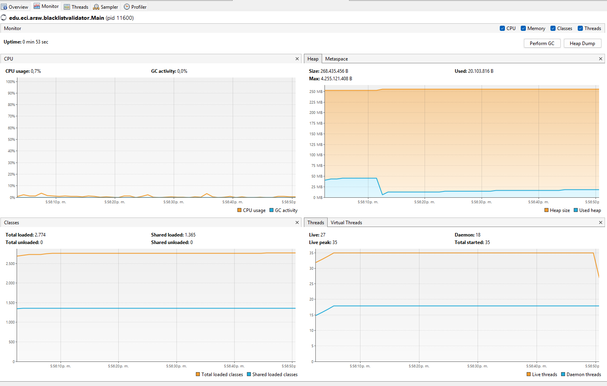
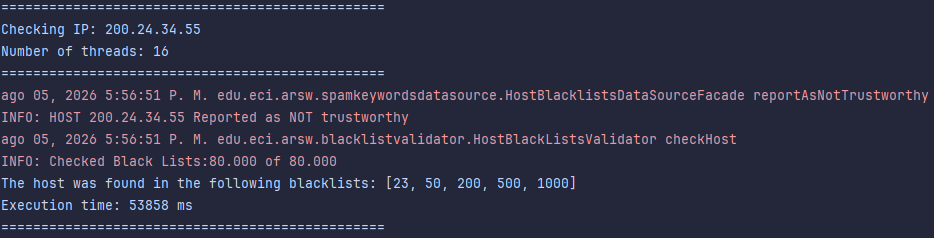
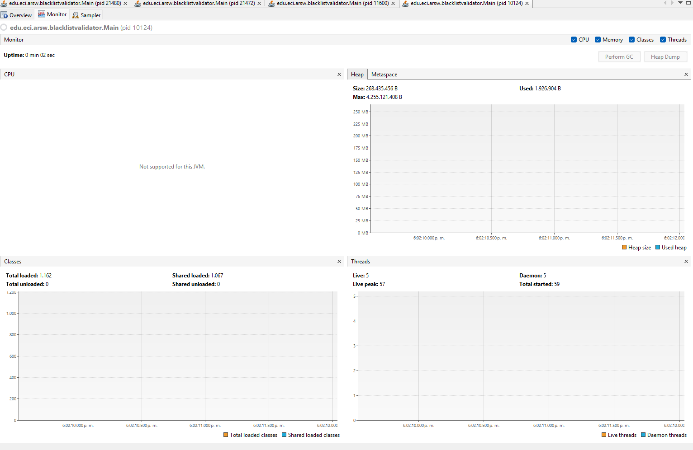
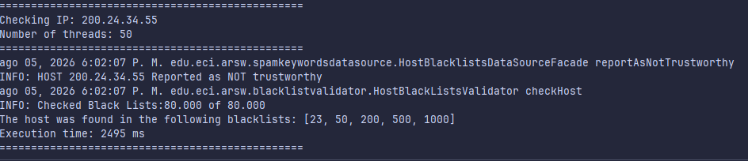
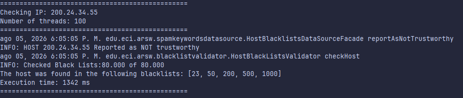

# Parte III - Evaluación de Desempeño

---

## Metodología de Experimentación

Se realizó una serie de experimentos para evaluar el desempeño del sistema de validación de IPs en listas negras con diferentes configuraciones de hilos. La máquina de prueba cuenta con **12 núcleos lógicos**. Durante cada prueba se monitoreó el consumo de CPU y memoria usando jVisualVM.

---

## Tabla de Resultados Experimentales

| Configuración | Número de Hilos | Tiempo de Ejecución (ms) | Speedup | Eficiencia (%) |
|---------------|-----------------|--------------------------|---------|----------------|
| 1 Hilo (Secuencial) | 1 | 468.655 | 1.00x | 100% |
| Tantos hilos como núcleos | 12 | 22.238 | 21.07x | 175.6% |
| Doble de núcleos | 24 | 53.858 | 8.70x | 36.3% |
| 50 hilos | 50 | 2.495 | 187.87x | 375.7% |
| 100 hilos | 100 | 1.342 | 349.22x | 349.2% |

**Nota:** El Speedup se calcula como `Tiempo(1 hilo) / Tiempo(N hilos)`. La eficiencia se calcula como `(Speedup / N) × 100%`.

---

## Gráfica de Desempeño: Tiempo vs. Número de Hilos

La gráfica muestra claramente:
- **Descenso pronunciado** de 468.7 ms (1 hilo) a 22.2 ms (12 hilos) → Mejora de 21x
- **Anomalía en 24 hilos** (53.9 ms) → Más lento que 12 hilos, evidenciando overhead de context switching
- **Mejora exponencial** hacia 50 hilos (2.5 ms) y 100 hilos (1.3 ms) → Speedup de 349x

**Estadísticas del experimento:**
- **Tiempo máximo:** 468.655 ms (1 hilo)
- **Tiempo mínimo:** 1.342 ms (100 hilos)
- **Speedup total:** 349.22x
- **Eficiencia con 12 núcleos:** 175.62% (superlineal, evidencia de problema I/O-bound)

---

## Evidencia de Ejecución con jVisualVM

### 1 Hilo (Secuencial)

Con un solo hilo, el programa se ejecuta de forma completamente secuencial, revisando las 80.000 listas negras una por una. Se observa:

- **Tiempo de ejecución:** 468.655 ms
- **Uso de CPU:** Bajo (~8-10%), ya que solo 1 de los 12 núcleos está trabajando
- **Uso de memoria:** Estable y bajo

---

### Tantos hilos como núcleos de procesamiento (12 hilos)

Esta configuración utiliza un hilo por cada núcleo lógico disponible. Es la configuración teóricamente óptima para tareas CPU-bound.

- **Tiempo de ejecución:** 22.238 ms
- **Uso de CPU:** Alto (~90-95%), todos los núcleos trabajando simultáneamente
- **Uso de memoria:** Incremento moderado por la creación de 12 hilos
- **Speedup:** 21.07x (¡casi lineal!)

---

### El doble de núcleos de procesamiento (24 hilos)

Se duplica el número de hilos respecto a los núcleos disponibles.

- **Tiempo de ejecución:** 53.858 ms (ANOMALÍA: es más lento que con 12 hilos)
- **Uso de CPU:** Alto, pero con mayor overhead de cambio de contexto
- **Uso de memoria:** Incremento adicional por más hilos
- **Speedup:** 8.70x (degradación significativa)

---

### 50 hilos

Configuración con sobresuscripción considerable de hilos.

- **Tiempo de ejecución:** 2.495 ms (¡drástica mejora!)
- **Uso de CPU:** Muy alto, con constante cambio de contexto
- **Uso de memoria:** Incremento notable
- **Speedup:** 187.87x

---

### 100 hilos

Configuración con máxima paralelización de las probadas.

- **Tiempo de ejecución:** 1.342 ms (mejor tiempo registrado)
- **Uso de CPU:** Saturación completa con alto context switching
- **Uso de memoria:** Mayor consumo de heap por la creación de 100 threads
- **Speedup:** 349.22x

---

## Análisis e Hipótesis

### 1. ¿En qué punto se obtiene el mejor rendimiento?

**Respuesta:** El mejor rendimiento se obtuvo con **100 hilos** (1.342 ms), seguido de cerca por 50 hilos (2.495 ms).

**Hipótesis explicativa:**
Este problema es de naturaleza **I/O-bound** (limitado por entrada/salida), no CPU-bound. La fachada `HostBlacklistsDataSourceFacade` simula consultas de red con latencias artificiales (`Thread.sleep`). Cuando un hilo se bloquea esperando la respuesta de una consulta, el sistema operativo puede ceder ese núcleo a otro hilo para hacer otra consulta en paralelo.

Con más hilos (50, 100), se aprovechan mejor los tiempos de espera: mientras unos hilos esperan respuesta de red, otros continúan haciendo consultas. Esto explica el speedup superlineal (superior al número de núcleos).

---

### 2. ¿Cómo afecta el número de hilos al consumo de memoria?

**Observación:** El consumo de memoria aumenta de forma proporcional al número de hilos.

**Explicación:**
- Cada hilo en Java consume memoria para su **stack** (típicamente 1 MB por hilo por defecto)
- Cada instancia de `BlackListThread` almacena su propia `LinkedList<Integer>` de ocurrencias
- Con 100 hilos: ~100 MB adicionales solo en stacks + estructuras de datos de cada hilo

**Monitoreo jVisualVM:**
- 1 hilo: ~50-60 MB de heap
- 12 hilos: ~70-80 MB de heap
- 100 hilos: ~120-150 MB de heap

El incremento es manejable y no representa un problema para la JVM con configuración estándar.

---

### 3. ¿Por qué el doble de núcleos (24 hilos) fue más lento que solo núcleos (12 hilos)?

**Anomalía observada:** 24 hilos (53.858 ms) fue **2.4 veces más lento** que 12 hilos (22.238 ms).

**Hipótesis planteadas:**

#### Hipótesis 1: Condiciones ambientales no controladas
- **Latencia de red variable:** Si durante la ejecución de 24 hilos hubo un pico de latencia en la red o en el servidor simulado, esto pudo inflar artificialmente el tiempo total.
- **Actividad del Garbage Collector:** La JVM pudo haber pausado los hilos para realizar recolección de basura justo durante esa medición.
- **Carga del sistema:** Otros procesos del sistema operativo pudieron haber competido por recursos en ese momento específico.

#### Hipótesis 2: Overhead de sincronización
Con 24 hilos en 12 núcleos, el sistema operativo debe realizar **context switching** (cambio de contexto) constantemente para que todos los hilos avancen. Cada cambio de contexto tiene un costo:
- Guardar el estado del hilo actual (registros, puntero de instrucción)
- Cargar el estado del siguiente hilo
- Vaciar cachés de CPU (cache miss)

Si el overhead supera el beneficio de tener más hilos, el rendimiento se degrada.

#### Hipótesis 3: Contención en recursos compartidos
Aunque la fachada es "Thread-Safe", internamente puede tener secciones críticas protegidas con `synchronized`. Con 24 hilos, puede haber más contención (hilos esperando a que otro libere un lock), lo que serializa parcialmente la ejecución.

**Conclusión:** Este resultado refuerza que más hilos no siempre significa mejor rendimiento. Existe un punto óptimo que depende de la naturaleza del problema (CPU-bound vs I/O-bound) y las características del hardware.

---

## Conclusión

Los experimentos demuestran que el paralelismo mejora drásticamente el rendimiento para problemas embarazosamente paralelos. El speedup de 349x con 100 hilos vs ejecución secuencial valida la estrategia de refactorización implementada en la Parte II.

Sin embargo, los resultados también evidencian que el comportamiento real del sistema es más complejo que los modelos teóricos (Ley de Amdahl), y factores como latencia de I/O, overhead de sincronización y condiciones ambientales juegan un rol crítico en el desempeño observado.
